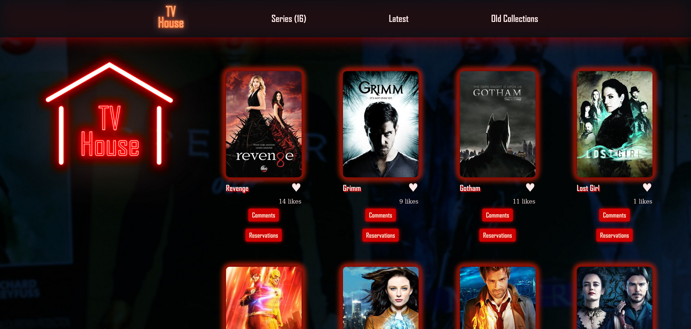
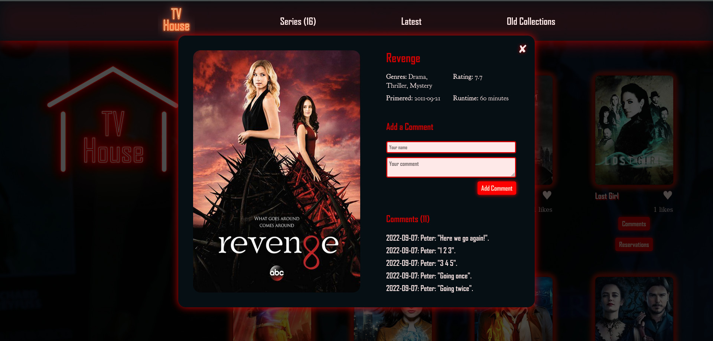
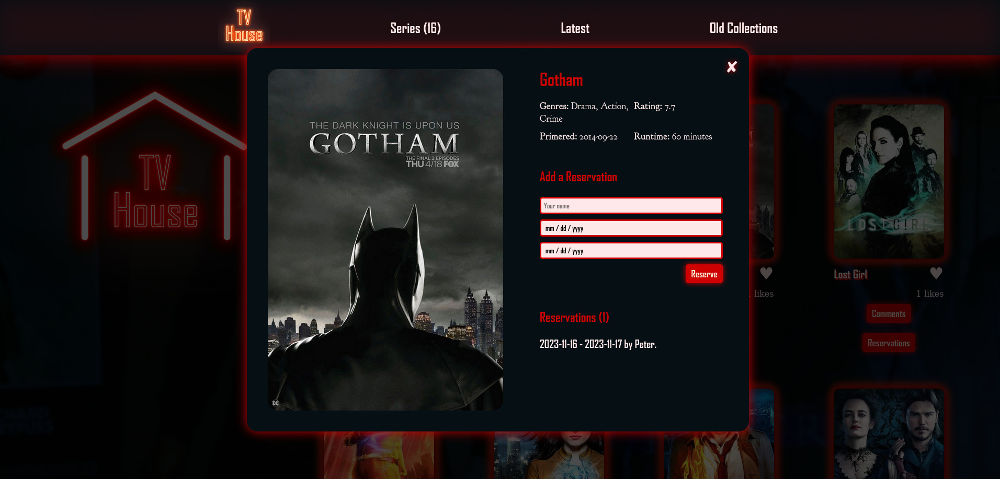

# capstone-2 Movie App

> This capstone shows you movies and shows using 2 APIs, one from whence we retreive the shows, and the other one Involvement API which stores and deliver comments and likes for each movie!

## Built With

- HTML, CSS and JavaScript
- Webpack
- Jest test framework
- Using Gitflow

## Live Demo 

[Live Demo Link](https://peter1907.github.io/CapstoneJS/)

## Screenshots

### Setup

## Getting Started

If you installed git you can clone the code to your machine, or download a ZIP of all the files directly.

Download the ZIP from this location, or run the following git command to clone the files to your machine:

`git clone https://github.com/Peter1907/CapstoneJS.git `
- Once the files are on your machine, open the Portfolio folder in Visual Studio Code.
- With the files open in Visual Studio Code, press the Go Live button at the bottom of the window to launch the files with Live Server.
- You can also directly open the HTML in the "dist" directory.

## Authors

👤 **Peter Beshara**

- GitHub: [@githubhandle](https://github.com/Peter1907)

👤 **Dhuruv Singh**

- GitHub: [@githubhandle](https://github.com/DhuruvSingh)

## 🤝 Contributing

Contributions, issues, and feature requests are welcome!

Feel free to check the [issues page](../../issues/).

## Show your support

Give a ⭐️ if you like this project!

## Acknowledgments

- A big kudos to everyone who worked hard to make this project a success.
- Background Photo by <a href="https://unsplash.com/@fkaregan?utm_source=unsplash&utm_medium=referral&utm_content=creditCopyText">Samuel Regan-Asante</a> on <a href="https://unsplash.com/s/photos/movies?utm_source=unsplash&utm_medium=referral&utm_content=creditCopyText">Unsplash</a>
- The logo icon & the backdroud design are done by <a href="https://github.com/Peter1907">Peter Beshara</a>.
